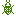

# プログラミング前準備
この章では円滑にプログラミングをすすめるための前準備を行います。
特に初心者のかたはフォルダ構造やファイルの位置、名前などに注意して読んでください。

## 骨組みの準備
JavaScript を用いてゲームを作成するため、まず骨組みとなる HTML ファイルおよび
骨組みとなるフォルダ構造を作成します。
なお HTML ファイルに関して詳しくは解説しませんので、興味がある方は下記リンク
を参照してください。

-   [HTML5.jp](http://www.html5.jp/)
-   [HTML5 リファレンス](http://www.htmq.com/html5/)
-   [Google HTML/CSS Style Guide](http://google-styleguide.googlecode.com/svn/trunk/htmlcssguide.xml)
-   [「Google HTML/CSS Style Guide」を適当に和訳してみた](http://re-dzine.net/2012/05/google-htmlcss-style-guide/)

では早速作成しましょう。
なお本記事ではフォルダ構造は下記のようになっていると仮定しています

    KawazAdventCalendar
        |
        +- src
            |
            +- index.html
            +- js
            |   |
            |   +- shooting.js
            |
            +- img
                |
                +- player.png
                +- enemy.png
                +- player_bullet.png
                +- enemy_bullet.png

まず上記に従い`js`フォルダおよび`img`フォルダを作成してください。
その後下記に上げる画像ファイルをダウンロードし、保存してください。

-   [player.png](../src/img/player.png) : 
-   [enemy.png](../src/img/enemy.png) : 
-   [player_bullet.png](../src/img/player_bullet.png) : 
-   [enemy_bullet.png](../src/img/enemy_bullet.png) : 

次に、`index.html`の内容を下記に記載するので、これを参考に作成してください。

```html
<!DOCTYPE html>
<meta charset="UTF-8">
<title>Kawaz Advent Calendar 2014-12-25</title>
```

最後にプログラムをメインに記述する`shooting.js`を`js`フォルダの中に下記の内容で作成してください。

```js
"use strict"
```

とりあえず骨組みはこれで完成です。


## 画像ファイルの読み込み
通常はプログラム中で動的に画像ファイルを読み込みますが、今回は初心者向けという
ことで**HTML の機能を利用して画像を読み込みます**。

HTML の機能を利用すると言いましたが、単純に``タグを使用するだけです。
下記のように`index.html`を変更しましょう。

```html
<!DOCTYPE html>
<meta charset="UTF-8">
<title>Kawaz Advent Calendar 2014-12-25</title>

```

この状態で`index.html`を Google Chrome で開いてみましょう。
どうでしょうか？左上に緑色の「バグ」が見えるでしょうか？
今回はこの「バグ」を操作するシューティングゲームを作成します。

では、同様にして他の画像もすべて読み込みましょう。
最終的な`index.html`は以下のようになります。

```html
<!DOCTYPE html>
<meta charset="UTF-8">
<title>Kawaz Advent Calendar 2014-12-25</title>


```

## キャンバスの作成
ゲームというのは実際のところ、動的なお絵かきに他なりません。
ユーザーのキー入力によって主人公が移動し、主人公が移動したことはユーザーに対して
「絵」という形で表現されます。

結局なにが言いたいかというと、プログラミングによってお絵かきが出来る「場所」さえ
あればそこにゲームを作ることが出来るという事です。
まぁ今は何を言っているかわからないかもしれませんが、そのうち解ると思います。

さて、JavaScript で絵を描くには`Canvas`（キャンバス）タグというものを使用します。
このキャンバスタグは HTML5 という新しい規格から表舞台に出てきた新機能で、
ホームページ上に動的にお絵かきができます。
別に HTML の歴史を語るために筆を持ったわけでは無いので割愛しますが、今回はこの
新機能を少しだけ使って初心者向けのシューティングゲーム作成を行なっていきます。

さて、うだうだと御託を述べるのはこの辺にして、早速このキャンバスタグを先程から
編集している`index.html`に追加しましょう。
以下のように`index.html`に修正を加えてください。

```html
<!DOCTYPE html>
<meta charset="UTF-8">
<title>Kawaz Advent Calendar 2014-12-25</title>


<canvas width='240' height='320'></canvas>
```

`<canvas width='240' height='320'></canvas>`が追加した部分になります。
追加部分において`width='240' height='320'`と書いて有りますが、この部分でキャンバス
の横幅（width）と縦幅（height）をピクセル数で設定しています。

## キャンバスのデザイン設定
さて、キャンバスの作成は終了しましたが今のままではどこがキャンバスなのかさっぱり
わかりません。
仕方がないので CSS という「装飾を施すための言語」を用いてキャンバスと背景のデザイン
を簡単に行います。
なお CSS に関しても本記事では取り扱わないので、興味のある方は下記リンクなどを参照
してください。

-   [CSS3リファレンス](http://www.htmq.com/css3/)
-   [一夜漬けでCSS3をマスターするために見ておくべきコードのまとめ](http://jsdo.it/event/topics/2011/07/css3showcase)

では早速下記のように`index.html`を編集してください。
**なおコード中の`# ...`とはその部分が略されていることを示します**。

```html
<!DOCTYPE html>
<meta charset="UTF-8">
<title>Kawaz Advent Calendar 2014-12-25</title>
<style>
  body {
    background: #eee;
  }
  canvas {
    background: #000;
  }
</style>

// ...
```

これで`index.html`を開くと少し大きめな黒い部分が表示されるようになりました。
ただ、左上に鎮座しておりあまり美しくありません。
せっかくなら CSS を使用して画面の左右中央に表示するようにしましょう。
以下のように再度修正を加えてください。

```html
<!DOCTYPE html>
<meta charset="UTF-8">
<title>Kawaz Advent Calendar 2014-12-25</title>
<style>
  body {
    background: #eee;
  }
  canvas {
    background: #000;
    display: block;
    margin: auto;
  }
</style>

// ...
```

これで画面の左右方向中央にキャンバスが表示されるようになりました。
なお上下方向中央に表示するには少し高度な CSS が必要になるためここでは割愛します。

## 名前を与える
ほぼ骨組みは完成しているのですが、このままではプログラムから使用することができません。
プログラムからこれらの要素を使用するためには「名前」が必要になります。
まぁ現実世界でもそうですよね？名前が無いものを呼んだりできませんから。

HTML で名前を与えるには`id="名前"`という記載をタグの中にしてやります。
なおひとつ重要な注意ですが**idで与えられた名前の（1ファイル内での）重複は許され
ていません**。
稀に HTML などを解説しているサイトでこの id を重複させているところがありますが、
間違いなので気をつけてください。

では、下記を参考にプログラムからアクセスする画像・キャンバス要素に名前を付けて
ください。

```html
<!DOCTYPE html>
// ...


<canvas id="screen" width='240' height='320'></canvas>
```

ちなみに気づいた方も多いと思いますが`id`の指定と`width`の指定で引用符が異なります。
ただこれは僕個人の趣味なので`id='名前'`としたり`width="240"`としても問題ありません
（僕は文字列を`"`で、数値を`'`で囲むようにしてます。結構忘れますが）。
ただ`'`で初めて`"`で終わるような使い方はできないので注意してください。
初心者のうちは混乱するかもしれませんが、**基本的に`'`と`"`は同じように「値を囲む」
時に使用します**。


## JavaScript ファイルのロード
さて、次の章から実際にプログラミングを行い始めます。
このプログラミングとはプログラムを書く作業のことを指します。
したがって「プログラムを書く場所」が必要となります。

JavaScript はこの「プログラムを書く場所」というのが2種類あります。
HTMLの「中」か「外」です。
気楽に書くにはHTMLの「中」が便利なのですが、今回はややこしくなるので「外」のみ
を使用します。
もし何か他の入門書などでHTMLの「中」に書いているコードがあった場合はそちらに
従ってください。

さて、ではこの「外」とは一体どこなのか？
それはもうお気づきかとは思いますが、すでに作成した`shooting.js`です。
この記事ではこの`shooting.js`にJavaScriptを書いて、この`shooting.js`を`index.html`
で読み込むことで実行させます。

はい、なので下記のように`shooting.js`を読み込んでください。
**なお、どこに`<script>`タグを置くかというのは非常に重要なので必ず位置を守ってください**。

```html
<!DOCTYPE html>
// ...


<canvas id="screen" width='240' height='320'></canvas>
<script src="js/shooting.js"></script>
```

これでプログラミングを行う準備はすべて整いました。
次の章から実際にプログラミングを始めましょう。

