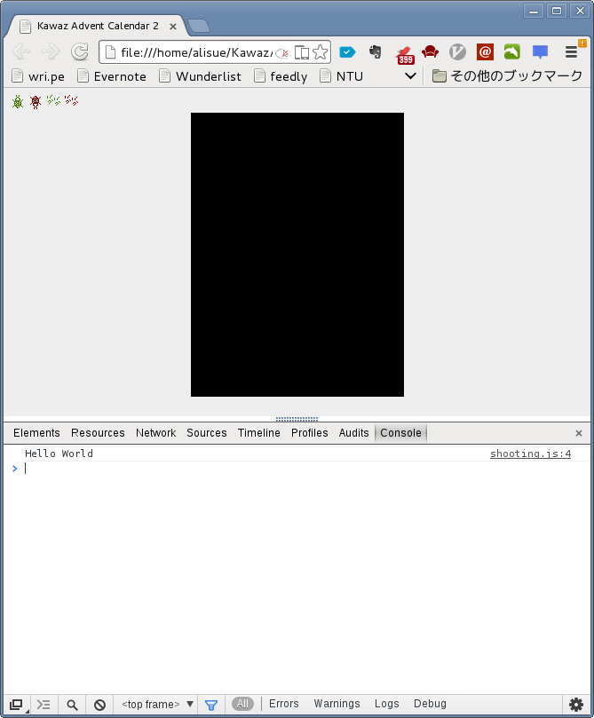

# プログラミング事始め
この章ではとりあえずプログラミングを行なってみます。
習うより慣れろ、この章は糞つまらないので多少わからないことがあっても立ち止まらず
に進んでみてください。

## Hello World
なぜかプログラミングの参考書などを見ると必ずこの Hello World が一番最初にあります。
まるで宗教のように存在する Hello World、文字を表示したってなんの面白みもありません。

さて、ここまでディスった癖に僕の記事でも Hello World を表示させます。
理由は簡単。
文字列の出力が出来ると「デバッグ情報」が出せるようになるからです。
なんのことかはそのうち解ると思います（たぶんこの辺がどの参考書でも Hello World
を最初に取り上げる理由）。

では早速 `shooting.js` を開いて下記のように修正してください（ `index.html` じゃ
ないので注意！）。

```javascript
"use strict"

// デベロッパーツールにログとして表示
console.log("Hello World");
```

保存後に `index.html` を再表示（ `F5` か `Command + R` ）してください。
Hello World と表示されれば成功です。

え？表示されない？

おそらく「デベロッパーツール」が表示されていないためです。
とりあえず気にせず読み進めましょう。

さて、今回のコードはすごーく短いですが、結構重要な要素を含んでいます。
なので各行それぞれ解説します。

### `"use strict"`
これを理解してもらうのは多分不可能なので**「おまじない」**だと思ってください。
**JavaScript を書く場合はファイルの先頭に必ず書くようにしてください**。
それを守るだけでプログラミングが上手になります。

### `// デベロッパーツールにログとして表示`
日本語が書いて有りますね。
日本語の意味も結構重要なのですが、ここで言いたいのはこの行が**コメント**であると
いうことです。

**コメント**とは「プログラムの実行に直接関係がなく、実行時に無視される文字列」
のことです。
まぁ簡単に言うと**「コメントには基本的に何を書いても良い」**ということです（基本的
と断ったのは環境依存文字を使った絵文字入りのコメントのせいでプロジェクトがコンパイル
できなくなった事例などがあるためw）。

本記事ではこのコメントにいろいろな使い方や説明を記載していくので、見た瞬間に
「あ、これはコメントだ」と分かるようになってください。

では、どのようなものがコメントなのかを説明します。
まぁ説明ってほどじゃないですけど、JavaScriptでは以下のような部分がコメントになります。

1.  **`//` 以降、改行まで**
2.  **`/*` と `*/` で囲まれている部分前部**

個人的には`//`を使用したコメントが好きなので、この記事ではそれだけ覚えていれば
大丈夫です。

### `console.log("Hello World");`
ここが実際のコードになります。
**コンソール**というところに「Hello World」と出力するコードです。

で、このコンソールってのはどこかというと「デベロッパーツール」という場所にあり
ます。
**この「デベロッパーツール」ですが、普段は見えないので出せるようになってください**。
Windowsの場合は `F12` キーを、Macの場合は `Command + Option + I` を押してください。
なお、このデベロッパーツールは詳しく説明すると記事が一本かけるくらい多機能なので
解説は割愛します。詳しく知りたい方は下記リンクをご覧ください。

-   [Web開発でよく使う、特に使えるChromeデベロッパー・ツールの機能](http://www.buildinsider.net/web/chromedevtools/01)
-   [「Google Chrome Deveoper Tools」はこう使う！基本機能チュートリアル & GDD 2011 セッション概要](http://codezine.jp/article/detail/6261)
-   [（非開発者でも使える）「Chrome Developer Tools」を使ってみよう！](http://www.lifehacker.jp/2013/09/130930chrome_developer_tools.html)

さて、「デベロッパーツール」の出し方もわかったので先ほどと同様に再表示をさせたあと
この「デベロッパーツール」を出してみてください。
下記参考画像のように Hello World と表示されていれば成功です。



## Hello World 変数編
どんどん行きましょう。
次はどうしても最初に解説しなくてはいけない**「変数」**について説明します。

**「変数」**というのは簡単に言うと**「箱」**です。
プログラミングをしているといろいろな値が出てきます。
すごく長い計算を使って出した数字やユーザーから入力してもらったチャットの内容など
です。
**変数はこれらの値を格納するための箱だと思っていただければだいたい正解です**。
ただ、このように説明されてもわかりにくいと思うので以下の様に `shooting.js` を
書き換えて、実行（ `index.html` を再表示）してみてください。

```javascript
"use strict"
// 変数 message を定義
var message;
// 変数 message に「文字列」を代入
message = "Hello World";

// デベロッパーツールにログとして表示
console.log(message);

// 変数 number を定義して「文字列」を代入
var message2 = "ハローワールド";

// デベロッパーツールにログとして表示
console.log(message2);
```

これを実行するとコンソールに下記のように表示されるはずです。

    Hello World
    ハローワールド

### 変数の定義は`var`から始まる
変数というのは `var 変数名;` とすると**定義**することができます。
変数という箱はどこにでも存在しているわけではなく、このように**定義**をしないと
使うことができません。
現実世界でも「箱」ってのは買うなり作るなりしないと存在しませんよね？
もしも「俺は思っただけで箱が現れるけど、なにか？」というならば、こんな記事を
読んでないで僕にその超能力の研究をさせてください。

さて、変数は定義しただけでは空っぽです。
この空っぽの変数の中に値を入れることを**代入する**といいます。
なので上記の `message = "Hello World";` という部分は「 `message` という変数の中に
`"Hello World"` という文字列を入れてね」という意味です。

変数はこのように**定義**して**代入**ということをよく行うので、もっと短く書く方法
があります。
その方法が `var message2 = "ハローワールド";` の部分で、このように**定義**して
**代入**というのが一行で書けます。
単純に定義して代入しているだけなので、この先こういう書き方を見ても混乱しないでく
ださいね。


## 文字列と数値と真偽値
最後にどうしても説明しなきゃいけない**文字列**と**数値**と**真偽値**を説明します。

すでに変数を学んだ皆さんは、実は小学校の文章題くらいならプログラミングで解けるよ
うになっています。
例を見ましょう。

>   【算数】たかしくんは1個60円のりんごを握りしめ、滅びゆく世界の中、決意の眼差しで空を仰ぎ、
>   静かに呟きました。 「例え明日世界が滅亡しようとも、今日僕はりんごの木を植えるよ」 
>   常に希望を捨てず、最後まで生き抜こうとするたかし君の目にはどんな未来が映っているでしょうか
>   。  
>   (出典: http://matome.naver.jp/odai/2134324699886988501)

ではこの問題をプログラミングで解いてみます。
この問題は文章題なので、よりわかりやすく整理すると

1.  たかしくんの**所持金**は**500円**
2.  1個**60円**の**りんご**が**3つ**
3.  1個**30円**の**みかん**が**4つ**

です。
太字にしたところがまさにプログラミングで使う「名前」や「値」です。
ではたかしくんの残金を計算してみましょう。
`shooting.js` を以下のように修正してください。

```javascript
"use strict"
// --- 必要な変数をすべて定義（複数定義する場合は , で区切る）

// pocket -- 所持金
var pocket;
// apple_price -- りんごの値段
// apple_count -- りんごの個数
var apple_price, apple_count;
// orange_price -- みかんの値段
// orange_count -- みかんの個数
var orange_price, orange_count;

// --- 文章題で与えられた数値を代入

// 所持金は500円
pocket = 500;

// りんごの値段は60円
apple_price = 60;
// りんごの数は3つ
apple_count = 3;

// みかんの値段は30円
orange_price = 30;
// みかんの数は4つ
orange_count = 4;

// 残高を求める
//
// balance -- 残高
// 残高 = 所持金 - りんごの値段 x りんごの個数 - みかんの値段 x みかんの個数
//
// 注意: コンピュータでは掛け算は * を使う
//
var balance = pocket - apple_price * apple_count - orange_price * orange_count;

// 残高を表示
console.log("たかしくんの残金は" + balance + "円");
```

これを実行すると「たかしくんの残金は200円」と表示されると思います。
ちゃんと計算されてますね。

さて、鋭い方はもうお気づきかと思いますが**変数に値を代入する部分で `"` や `'` 
などの引用符が使われていません**。
実は**引用符**で囲う値は**文字列**だけです。
正確には**引用符で囲うと文字列になります**。

コンピューターはあまりにも正確すぎるので僕ら人間のような「推測」ができません。
これとは対照的に、人間は「推測」が得意です。
ほら、小学校の頃に「1 + 1 =」とか流行りませんでしたか？
僕の頃は文脈や状況によって「田んぼの田」と答えたり、「2」と答えたり、柔軟な対応
ができて初めて仲間として認められたものでした。
しかしコンピュータは推測ができないので「1 + 1 =」と聞かれると必ず「2」と答え、
小学校4年生くらいの男の子に馬鹿にされます。

たぶん、いくら戯言を述べても混乱するだけなので例を見せましょう。
各コードの出力結果はコード下にコメントで示しました。

```javascript
console(1 + 1);
// 出力: 2

console('Hello' + 'World');
// 出力: HelloWorld

console('1' + '1');
// 出力: 11
```

この例からも分かるように**文字列の連結は `+` で行います**。
また当たり前ですが**数値の足し算も `+` で行います**。
人間なら「推測」によって文字列の連結をすべきなのか、足し算をすべきなのか
だいたいわかると思いますが、コンピューターにはそれができないため
`console('1' + '1');` の結果が `11` になります。

ちなみに D言語（Dark Language）と呼ばれる暗黒物質理論と量子力学、
特殊相対性理論という現代物理学の最先端理論を元に研究開発された 新しい
プログラミング言語は、文字列の連結に `~` を使うという誰も思いつかなかった
素晴らしい方法でこの問題を解決しています（98%嘘です）。

話がそれましたが、このような「値の種類」というのは型と呼ばれ、他にも様々な
ものがあります。
その中に、「イエス」か「ノー」の二択を表す型があり、その値は**真偽値**と
呼ばれます。


（出典: http://www.personalised-gifts-engraved.com/acatalog/4_Angel_Devil_Pillow_Case.html）

プログラミングをしているとよく「イエス」か「ノー」の二択に迫られます。
例えば、僕の夜の行動を「[プログラミング言語 なでしこ](http://nadesi.com/top/)」
的な仮想言語で表現するならば下記のようになります。

```
もし、夕飯ができている ならば
    もし、お寿司 ならば
        「いまから帰る」と表示。
    もし、ビール ならば
        「いまから帰る」と表示。
    もし、冷えたご飯 ならば
        「もう食べた」と表示。
違えば
    「食べて帰る」と表示。
```

ここで示した条件はすべて「イェス」と「ノォー」で表される条件です。
このように「イエス」か「ノー」と言う二択の値はよく使うため `true` （真）
と `false` （偽）というように表されます。
ここではこれ以上解説しないですが、頭の片隅にでもおいておいてください。

この書いてる方も読んでる方も眠くなる章はこれで終わりです。
次の章からはもっと楽しいことをしましょう。

