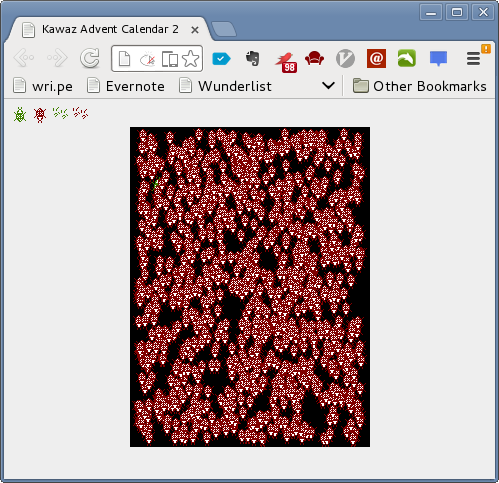

# キャラクターを表示する
文字列の表示なんて面白味のないことはやめて画像を表示しましょう。
この章では「画像の表示」以外にも「ランダム処理」や「ループ処理」など
ゲームを作る上で欠かせない技術について説明します。

## キャンバスに描画する
前準備でもさらっと説明したように、この記事ではJavaScriptでキャンバスに絵を書く
ことでゲームを作ります。
この**キャンバス**というのは以下の3ステップを踏むことで使えるようになります。

1.  キャンバスオブジェクトを取得
2.  コンテキスト（とよばれるナニか）をキャンバスオブジェクトから作成
3.  コンテキストの中に入っている道具（メソッド）を使ってお絵かき

詳しい説明は割愛するとして、実際に何か描画してみましょう。
下記のように `shooting.js` を書き換えてください。

```javascript
"use strict"
// 全体で使用する変数を定義
var canvas, ctx;

// ページロード時に呼び出される処理を指定
// window.onload = function(){ から }; までの間が呼び出される。
window.onload = function() {
    // id を用いてキャンバスオブジェクトを取得し
    // canvas 変数に代入
    //
    //   オブジェクト = document.getElementById('id');
    //
    canvas = document.getElementById('screen');

    // 2次元用の描画コンテキスト（とよばれるナニか）を取得し代入
    ctx = canvas.getContext('2d');

    // 塗りつぶしの色を指定（白）
    ctx.fillStyle = '#fff';
    // 塗りつぶされた四角形（横,縦 = 20, 30）を（8, 5）の位置に描画
    ctx.fillRect(8, 5, 20, 30);

    // 線の色を指定（赤）
    ctx.strokeStyle = '#f00';
    // からっぽの四角形（横,縦 = 90, 10）を（40, 55）の位置に描画
    ctx.strokeRect(40, 55, 90, 10);
};
```

これで塗りつぶされた白色の四角形と赤い四角の枠が描画されていれば成功です。
なお今回のコードに関しては詳しく説明する必要がないため、説明は割愛します。
読み進めることを優先してください。


## キャンバスに画像を描画する
四角形を描画してもなにも面白くないので、とっとと画像を描画しましょう。
画像を描画するにはコンテキスト（`ctx`）の `drawImage(img, x, y)` というメソッド
を利用します。
下記コードを参考に `shooting.js` を書き換えてください。
なお理解不要のお決まり部分のコメントは削除しました。

```javascript
"use strict"
// 全体で使用する変数を定義
var canvas, ctx;
// プレイヤーの画像を保持する変数を定義
var img_player;

// ページロード時に呼び出される処理を指定
window.onload = function() {
    // コンテキストを取得（おまじない）
    canvas = document.getElementById('screen');
    ctx = canvas.getContext('2d');

    // Playerの画像（id='player'で指定された）を取得
    img_player = document.getElementById('player');

    // Playerの画像を (20, 50) の位置に描画
    ctx.drawImage(img_player, 20, 50);
};
```

これでキャンバス（黒い部分）の中に緑色の「バグ」が表示されれば成功です。


さて、先程から何の気なしに


>   Playerの画像を (20, 50) の位置に描画

のように `(数字, 数字)` という書き方をしてきましたが、これは**座標**を表します。
**座標**と聞くと死に急ぎ野郎が出てくる昨今ですが、元々は**位置**を明確に表す
ためのものです。
中学校で習っているはずなので、あんまり詳しくは解説しませんがコンピューターの場合
原点座標 (0, 0) は左上に設定されることが多いです。
今回の場合も同様で (10, 20) と (20, 30) では前者のほうが左上よりです。
座標がどのように描画位置を変えているかは実際に値を変化させて確かめてみてください。

## キャンバスに画像をたくさん描画する
さて、せっかくプレイヤーを表示したので敵キャラも表示しましょう。
以下のように `shooting.js` を改変してください。

```javascript
"use strict"
// 全体で使用する変数を定義
var canvas, ctx;
// プレイヤーの画像を保持する変数を定義
var img_player;
// 敵キャラの画像を保持する変数を定義
var img_enemy;

// ページロード時に呼び出される処理を指定
window.onload = function() {
    // コンテキストを取得（おまじない）
    canvas = document.getElementById('screen');
    ctx = canvas.getContext('2d');

    // Playerの画像（id='player'で指定された）を取得
    img_player = document.getElementById('player');
    // 敵キャラの画像（id='enemy'で指定された）を取得
    img_enemy = document.getElementById('enemy');

    // Playerの画像を (20, 50) の位置に描画
    ctx.drawImage(img_player, 20, 50);
    // 敵キャラの画像を (30, 60) の位置に描画
    ctx.drawImage(img_enemy, 30, 60);
};
```

これを実行すると、プレイヤー（緑バグ）のすぐ隣に寄り添うよう敵キャラ（赤バグ）
が表示されると思います。

さて、今回作るのはシューティングゲームなので敵キャラはたくさん出てくるはずです。
なのでとりあえず15匹くらい表示しましょう。
以下のように `shooting.js` を書き換えてください。
なおコード中に `// ...` で示された部分は省略を表しています。
その部分のコードは消さないで残しておいてくださいね。

```javascript
// ...

// ページロード時に呼び出される処理を指定
window.onload = function() {
    // ...

    // Playerの画像を (20, 50) の位置に描画
    ctx.drawImage(img_player, 20, 50);
    // 敵キャラの画像をいろんなところに描画
    ctx.drawImage(img_enemy, 60, 20);
    ctx.drawImage(img_enemy, 60, 30);
    ctx.drawImage(img_enemy, 60, 40);
    ctx.drawImage(img_enemy, 60, 50);
    ctx.drawImage(img_enemy, 60, 90);
    ctx.drawImage(img_enemy, 90, 20);
    ctx.drawImage(img_enemy, 90, 30);
    ctx.drawImage(img_enemy, 90, 40);
    ctx.drawImage(img_enemy, 90, 50);
    ctx.drawImage(img_enemy, 90, 90);
    ctx.drawImage(img_enemy, 120, 20);
    ctx.drawImage(img_enemy, 120, 30);
    ctx.drawImage(img_enemy, 120, 40);
    ctx.drawImage(img_enemy, 120, 50);
    ctx.drawImage(img_enemy, 120, 90);
};
```

どうでしょうか？なんだかすごく恣意的に整列してますね。

### 敵キャラの位置をランダムに決定する
やはりせっかくプログラミングをしているので敵キャラの位置は**ランダム**に
決めたいですよね？
ランダムな位置を決めるにはランダムな値が必要です。
JavaScript でランダムな値を取得するには `Math.random()` というものを使用します。
この `Math.random()` は0から1までの値をランダムで返すので、欲しい値を掛け算して
やると好きな大きさのランダムな数字を得ることができます。
やってみましょう。
以下の要領で `shooting.js` を修正してください。

```javascript
// ...

// ページロード時に呼び出される処理を指定
window.onload = function() {
    // ...

    // Playerの画像を (20, 50) の位置に描画
    ctx.drawImage(img_player, 20, 50);
    // 敵キャラの画像をランダムな位置に表示（とりあえず一匹）
    ctx.drawImage(img_enemy, Math.random() * 100, Math.random() * 100);
};
```

これを何度か実行してみてください。
実行するたびに敵キャラの位置が変わっていれば成功です。

さて、何度か実行していると敵キャラがすごーく狭い範囲でしか動いていないことが
わかります。
キャンバスのサイズは 240 x 320 で作成しましたよね？
それにも関わらず上記コードでは 100 x 100 の中でランダムな位置を指定しています。
じゃぁ `Math.random() * 320` とかやればいいじゃんということになりますが、せっかく
なのでキャンバスのサイズをプログラミングで取得しましょう。

キャンバスのサイズは `canvas.width` と `canvas.height` で取得できます。
それぞれ横幅と縦幅ですね。
これを踏まえて上記のコードを修正したものが下記になります。
参考にして `shooting.js` を書き換えてください。

```javascript
// ...

// ページロード時に呼び出される処理を指定
window.onload = function() {
    // ...

    // Playerの画像を (20, 50) の位置に描画
    ctx.drawImage(img_player, 20, 50);
    // 敵キャラの画像をランダムな位置に表示（とりあえず一匹）
    // なお、下記のように () の中は , の位置で改行しても構わない
    ctx.drawImage(img_enemy,
                  Math.random() * canvas.width,
                  Math.random() * canvas.height);
};
```

さて、これでどうでしょうか？完成でしょうか？

これを何度か実行すると稀に敵キャラが右か下の端っこに隠れてしまうことがあると
思います。
まぁこれは簡単な話で `drawImage(img, x, y)` というメソッドは**対象の画像の左上
を (x, y) の位置にあわせて描画する**関数だからです。
ランダムに取得した値がキャンバスの幅ギリギリだと、そこから画像の描画を右下に向か
って始めるので画像が全部表示されません。
じゃぁどうすればいいかというと、画像の横幅をキャンバスの横幅から引いてあげれば
いいですね。
こうすればランダムに取得した値の最大値でも画像はキャンバスの中に収まります。

上記を踏まえて修正したコードが下記です。
このように `shooting.js` を修正してください。

```javascript
// ...

// ページロード時に呼び出される処理を指定
window.onload = function() {
    // ...

    // Playerの画像を (20, 50) の位置に描画
    ctx.drawImage(img_player, 20, 50);
    // 敵キャラの画像をランダムな位置に表示（とりあえず一匹）
    // なお、下記のように () の中は , の位置で改行しても構わない
    ctx.drawImage(img_enemy,
                  Math.random() * (canvas.width - img_enemy.width),
                  Math.random() * (canvas.height - img_enemy.height));
};
```

何度かリロードして敵キャラが常にキャンバス内に描画されることを確認してください。

### ループ処理で馬鹿みたいにたくさん敵を描画する
さて、ランダムに敵の位置を決定できるようになったので大量に敵を表示しなおします。
ただ先程のように一つづつ書いていくと、例えば1000匹の敵を表示しようとすると骨が
折れます。
せっかくプログラミングをしているのだから、こういうくだらない処理はコンピュータに
任せたいところ。

JavaScriptにおいて、このような**繰り返し処理**を行う場合**for文**というものを
使用します（他に**while文**などもあるが扱わない）。
この**for文**は以下のような定義になっています。
なお、より詳しくは[for文 - JavaScript入門](http://www.pori2.net/js/kihon/14.html)
あたりを参照すると良いと思います。

```javascript
for(はじめに呼ばれるコード; 終了判定に使われるコード; 各ループ後に呼ばれるコード) {
    ループされる処理
}

// 主な使い方
// 下記コードはコンソールに0から99までを表示します
//  | var i=0; で変数iというのを定義し、0を入れます
//  | i<100; でiが100未満であれば処理を繰り返すという条件を与えます
//  | i++ でiの値を1増やします（インクリメント）
for(var i=0; i<100; i++) {
    console.log(i);
}
```

ではこの**for文**を使って1000匹の敵キャラをランダムに描画してみましょう。
下記を参照して `shooting.js` を書き換えてください。


```javascript
// ...

// ページロード時に呼び出される処理を指定
window.onload = function() {
    // ...

    // Playerの画像を (20, 50) の位置に描画
    ctx.drawImage(img_player, 20, 50);
    // 敵キャラの画像をランダムな位置に表示
    for(var i=0; i<1000; i++) {
        ctx.drawImage(img_enemy,
                    Math.random() * (canvas.width - img_enemy.width),
                    Math.random() * (canvas.height - img_enemy.height));
    }
};
```

下記参考画像のように気持ちが悪いくらいたくさんのバグが表示されれば成功です。
ただこのままだと気持ち悪いので 10 匹だけ表示するように改良しておいてください。



