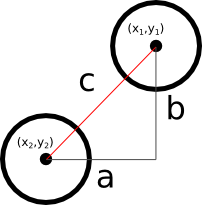

# 当たり判定をする
ついにここまでたどり着きました。
シューティングゲームの花形である当たり判定を解説します。
まぁ当たり判定といってもいろいろな方法がありますが、
今回は初心者向けという事で比較的簡単な「円を使った当たり判定」のみ解説します。

## 三平方の定理
別名ピタゴラスの定理ですね。
これさえわかっていれば簡単です。
「直角三角形の斜辺の長さの二乗は他二辺の長さの二乗を足しあわせたものと等しくなる」
という定理です。
思い出せましたか？

## 当たり判定への応用
応用もなにも下記図を見ていただければ一発だと思います。



図において各円はキャラクターや弾を表しているものとします。
各キャラクターの中心座標からキャラクター同士の距離が計算できますが、この距離が
各キャラクターの当たり判定用円の半径を足しあわせたものよりも短い場合は
「当たっている」。
それ以外の場合は「当たっていない」というシンプルな方法です。

## 汎用的な当たり判定関数の作成
シューティングゲームなので当たり判定の対象がキャラクターだったり弾だったりします。
いちいちそれぞれの当たり判定を書いていられないので、汎用的な当たり判定関数を作成
することにします。

上記「当たり判定への応用」を整理すると、当たり判定に必要なのは

1.  自分・対象の中心座標
2.  自分・対象の当たり判定用円の半径

の2つです。
今回は簡易化のため、当たり判定用の円は画像と同じ大きさにします。
また中心座標は自分の座標に横幅・縦幅の半分を足したものとします。
したがって下記のような関数を作れば良いことになります。
下記関数を `shooting.js` の「// メインループを定義」の上あたりに定義してください。

```javascript
var hitCheck = function(x1, y1, obj1, x2, y2, obj2) {
    var cx1, cy1, cx2, cy2, r1, r2, d;
    // 中心座標の取得
    cx1 = x1 + obj1.width/2;
    cy1 = y1 + obj1.height/2;
    cx2 = x2 + obj2.width/2;
    cy2 = y2 + obj2.height/2;
    // 半径の計算
    r1 = (obj1.width+obj1.height)/4;
    r2 = (obj2.width+obj2.height)/4;
    // 中心座標同士の距離の測定
    // Math.sqrt(d) -- dのルートを返す
    // Math.pow(x, a) -- xのa乗を返す
    d = Math.sqrt(Math.pow(cx1-cx2, 2) + Math.pow(cy1-cy2, 2));
    // 当たっているか判定
    // ちなみに `return r1+r2 > d;` とだけ書いてもOK
    if(r1 + r2 > d) {
        // 当たってる
        return true;
    } else {
        // 当たっていない
        return false;
    }
};
```

## プレイヤーと敵との当たり判定を作成
汎用的な関数ができたので、これを用いてプレイヤーと敵の当たり判定を書きます。
ただ、現在プレイヤーにも敵にもヒットポイントや死などの概念が無いため当たり判定
をしても面白みがありません。
したがってそれぞれにヒットポイントという変数を持たせ、ヒットポイントが0になった
ら描画をしないようにしてみます。

下記を参照しながら `shooting.js` を修正してください。

```javascript
// ...
// 敵キャラの現在位置（配列）を保持する変数を定義し
// ENEMIES分だけ要素数を持つ配列を代入
var enemies_x = new Array(ENEMIES);
var enemies_y = new Array(ENEMIES);
// プレイヤーのヒットポイント
var player_hp;
// 敵キャラのヒットポイント（配列）を保持する変数を定義し
// ENEMIES分だけ要素数を持つ配列を代入
var enemies_hp = new Array(ENEMIES);


// 再描画する関数（無引数、無戻り値）
var redraw = function() {
    // キャンバスをクリアする
    ctx.clearRect(0, 0, canvas.width, canvas.height);

    // 生きている場合だけ新しい位置にプレイヤーを描画
    if(player_hp > 0) {
        ctx.drawImage(img_player, player_x, player_y);
    }

    // 敵キャラの画像を (enemies_x[i], enemies_y[i]) の位置に表示
    for(var i=0; i<ENEMIES; i++) {
        // 生きている場合だけ描画
        if(enemies_hp[i] > 0) {
            ctx.drawImage(img_enemy, enemies_x[i], enemies_y[i]);
        }
    }
};

// プレイヤーの移動処理を定義
var movePlayer = function() {
    // ヒットポイントを確認し、生きている場合のみ処理をする
    if(player_hp <= 0) {
        return;
    }

    // ...

};
// 敵キャラの移動処理を定義
var moveEnemies = function() {
    // 上下左右の移動速度を定義
    var SPEED = 2;

    // 各敵キャラごとに処理を行う
    for(var i=0; i<ENEMIES; i++) {
        // ヒットポイントを確認し、生きている場合のみ処理をする
        if(enemies_hp[i] <= 0) {
            // ループの残りのステップを無視して次のループに行く場合
            // は `continue` を指定する
            continue;
        }

        // ...
    }
};

// 汎用的当たり判定関数
var hitCheck = function(x1, y1, obj1, x2, y2, obj2) {
    // ...
};

// メインループを定義
var mainloop = function() {
    // ...

    // 敵キャラの移動処理
    moveEnemies();

    // プレイヤーと敵キャラの当たり判定（プレイヤーが生きている場合）
    if(player_hp > 0) {
        for(var i=0; i<ENEMIES; i++) {
            // 敵が生きている場合のみ判定する
            if(enemies_hp[i] > 0) {
                if(hitCheck(player_x, player_y, img_player,
                            enemies_x[i], enemies_y[i], img_enemy)){
                    // 当たっているのでお互いのHPを1削る
                    player_hp -= 1;
                    enemies_hp[i] -=1;
                }
            }
        }
    }

    // 描画処理
    redraw();

    // ...
};

// ...

// ページロード時に呼び出される処理を指定
window.onload = function() {
    // ...

    // Playerの初期位置およびHPを指定
    // player_x = キャンバスの左右中央
    // player_y = キャンバスの下から20px上
    player_x = (canvas.width - player.width) / 2;
    player_y = (canvas.height -player.height) - 20;
    player_hp = 10;

    // 敵キャラの初期位置およびHPを指定
    for(var i=0; i<ENEMIES; i++) {
        enemies_x[i] = Math.random() * (canvas.width - img_enemy.width);
        enemies_y[i] = Math.random() * (canvas.height - img_enemy.height);
        enemies_hp[i] = 2;
    }

    // メインループを開始する
    mainloop();
};
```

