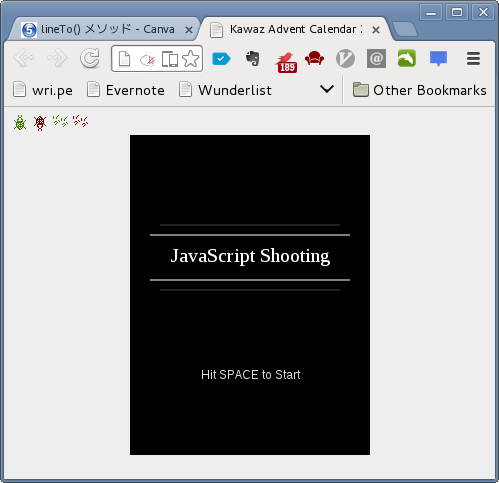

# 装飾する
「自分が死なないように弾を打って敵を倒す」というシューティングゲームの根幹は
完成しましたが、どうもあまりゲームっぽくありません。
この記事の締めくくりとして、ゲームっぽさを出すために画面を少し装飾します。

## 残りHPを表示する
残りHPを表示しましょう。
以下のように `shooting.js` を修正してください。

```javascript
// ...
// 再描画する関数（無引数、無戻り値）
var redraw = function() {
    // ...

    // コンテキストの状態を保存（fillStyleを変えたりするので）
    ctx.save();
    // HPの最大値（10）x 5 の短形を描画（白）
    ctx.fillStyle = '#fff';
    ctx.fillRect(10, canvas.height-10, 10 * 5, 5);
    // 残りHP x 5 の短形を描画（赤）
    ctx.fillStyle = '#f00';
    ctx.fillRect(10, canvas.height-10, player_hp * 5, 5);
    // コンテキストの状態を復元
    ctx.restore();
};
// ...
```

左下にHPバーが表示されれば成功です。

## 倒した敵の数を表示
倒した敵の数を表示しましょう。
キャンバスには `fillText` という文字列を描画するメソッドがあるのでこれを使用します。
以下のように `shooting.js` を修正してください。

```javascript
// ...
// 再描画する関数（無引数、無戻り値）
var redraw = function() {
    // ...

    // コンテキストの状態を保存（fillStyleを変えたりするので）
    ctx.save();
    // HPの最大値（10）x 5 の短形を描画（白）
    ctx.fillStyle = '#fff';
    ctx.fillRect(10, canvas.height-10, 10 * 5, 5);
    // 残りHP x 5 の短形を描画（赤）
    ctx.fillStyle = '#f00';
    ctx.fillRect(10, canvas.height-10, player_hp * 5, 5);

    // 「倒した敵の数/全敵の数」という文字列を作成
    var text = "Killed: " + killed + "/" + ENEMIES;
    // 文字列の（描画）横幅を計算する
    var width = ctx.measureText(text).width;
    // 文字列を描画（白）
    ctx.fillStyle = '#fff';
    ctx.fillText(text,
                 canvas.width - 10 - width,
                 canvas.height - 10);

    // コンテキストの状態を復元
    ctx.restore();
};
// ...
```

## 無敵時間を作る
通常、シューティングなどで攻撃をくらうと一定時間無敵になります。
これは毎フレームごとに「当たった」と言う処理が走りHPがものすごい勢いで削られる
のを防ぐための処理です。
今回、敵のHPが2しか無いので敵に当たってもダメージは2で済みますが、この先とても
硬い敵（プレイヤーにあたっても死なないような敵）を作るとすると同様の問題が発生
します。
そこで、例に習って無敵時間を作りましょう。

無敵時間を作る際に必要な考え方は、弾の連射速度を調整した時の考え方と同様です。
攻撃を受けた後、カウンターの値を一定値に設定し、その値が0に戻るまでは無敵と扱う
ことにします。

なお、この無敵時間は敵にも存在すべきなのですが、面倒くさいので割愛します。
余力のある人は例に習って敵にも無敵時間を作ってみてください。
では下記を参考に `shooting.js` を修正してください。

```javascript
// ...
// 発射インターバルの値を定義（この値が大きいほど連射が遅くなる）
var FIRE_INTERVAL = 20;
// 無敵インターバルの値を定義（この値が大きいほど無敵時間が長くなる）
var STAR_INTERVAL = 20;
// ...
// プレイヤーの発射インターバル
var player_fire_interval=0;
// プレイヤーの無敵インターバル
var player_star_interval=0;

// ...

// メインループを定義
var mainloop = function() {
    // ...

    // プレイヤーと敵キャラの当たり判定（プレイヤーが生きている場合）
    // かつプレイヤーが無敵ではない場合
    if(player_hp > 0 && player_star_interval == 0) {
        for(var i=0; i<ENEMIES; i++) {
            // 敵が生きている場合のみ判定する
            if(enemies_hp[i] > 0) {
                if(hitCheck(player_x, player_y, img_player,
                            enemies_x[i], enemies_y[i], img_enemy)){
                    // ...

                    // プレイヤーを無敵状態にする
                    player_star_interval = STAR_INTERVAL;
                }
            }
        }
    }
    // プレイヤーの無敵インターバルを減少させる
    if(player_star_interval > 0) {
        player_star_interval--;
    }

    // ...
};

// ...
```

## 無敵状態時に点滅させる
せっかくなので無敵時間中は点滅するようにしましょう。
まず JavaScript では `%` という演算子で「あまり」を計算できます。
したがって `X % 2` とすると 2 で割り切れる時は0、割り切れないときは1が帰って
きます。
これを用いると毎フレームごとに ON と OFF が切り替えられます。

またキャンバスは描画に透過度を持たすことができます `ctx.globalAlpha` の値を
変更してやると透過度が変わるので、これを使用して OFF の場合は半透明に描画する
ようにします。

では下記を参考に `shooting.js` を修正してください。

```javascript
// ...

// 再描画する関数（無引数、無戻り値）
var redraw = function() {
    // キャンバスをクリアする
    ctx.clearRect(0, 0, canvas.width, canvas.height);

    // 生きている場合だけ新しい位置にプレイヤーを描画
    if(player_hp > 0) {
        // 透過度を変えるのでコンテキストの状態を保存
        ctx.save();
        // 無敵時間の状態に応じて描画の透過度を変更
        if(player_star_interval % 2 != 0) {
            // 半透明に描画する
            ctx.globalAlpha = 0.5;
        }
        ctx.drawImage(img_player, player_x, player_y);
        // コンテキストの状態を戻す
        ctx.restore();
    }
    // 弾の画像を (bullets_x[i], bullets_y[i]) の位置に表示
    for(var i=0; i<BULLETS; i++) {
        // 生きている場合だけ描画
        if(player_bullets_hp[i] > 0) {
            ctx.drawImage(img_player_bullet,
                          player_bullets_x[i],
                          player_bullets_y[i]);
        }
    }
    // ...
};
// ...
```

## ゲームオーバー画面を作る
現状、ゲームオーバになっても特にナニも起こりません。
これじゃつまらないのでゲームオーバーになったら「Game Over」と表示するように
しましょう。
下記を参考に `shooting.js` を修正してください。

```javascript
// ...

// 再描画する関数（無引数、無戻り値）
var redraw = function() {
    // ...

    // コンテキストの状態を保存（fillStyleを変えたりするので）
    // ...

    // 「倒した敵の数/全敵の数」という文字列を作成
    // ...

    // プレイヤーが死んでいた場合ゲームオーバー画面を表示する
    if(player_hp <= 0){
        // 全体を半透明の黒い四角で覆う（オーバーレイ）
        ctx.globalAlpha = 0.5;
        ctx.fillStyle = '#000';
        ctx.fillRect(0, 0, canvas.width, canvas.height);
        ctx.globalAlpha = 1.0;

        // 真ん中に大きな文字でゲームオーバー（赤）と表示する
        ctx.font = '20px sans-serif';
        ctx.textBaseline = 'middle';    // 上下位置のベースラインを中心に
        ctx.fillStyle = '#f00';
        text = "Game Over";
        width = ctx.measureText(text).width;
        ctx.fillText(text,
                     (canvas.width - width) / 2,
                     canvas.height / 2);
    }

    // コンテキストの状態を復元
    ctx.restore();
};

// ...
```

## ゲームクリア画面を作る
では逆にゲームクリア画面も作りましょう。
下記を参考に `shooting.js` を修正してください。

```javascript
// ...

// 再描画する関数（無引数、無戻り値）
var redraw = function() {
    // ...

    // コンテキストの状態を保存（fillStyleを変えたりするので）
    // ...

    // 「倒した敵の数/全敵の数」という文字列を作成
    // ...

    // プレイヤーが死んでいた場合ゲームオーバー画面を表示する
    if(player_hp <= 0){
        // ...
    }
    // 敵を殲滅していた場合はゲームクリア画面を表示
    else if(killed == ENEMIES){
        // 全体を半透明の黒い四角で覆う（オーバーレイ）
        ctx.globalAlpha = 0.5;
        ctx.fillStyle = '#000';
        ctx.fillRect(0, 0, canvas.width, canvas.height);
        ctx.globalAlpha = 1.0;

        // 真ん中に大きな文字でゲームクリア（白）と表示する
        ctx.font = '20px sans-serif';
        ctx.textBaseline = 'middle';    // 上下位置のベースラインを中心に
        ctx.fillStyle = '#fff';
        text = "Game Clear";
        width = ctx.measureText(text).width;
        ctx.fillText(text,
                     (canvas.width - width) / 2,
                     canvas.height / 2);
    }

    // コンテキストの状態を復元
    ctx.restore();
};

// ...
```

## タイトル画面を作る（画面遷移）
では最後に、タイトル画面を作成しましょう。
タイトル画面では「Hit SPACE to Start」と表示させ、スペースキーが押されたら
ゲームを開始するようにします。

さて、ゲームオーバー画面やゲームクリア画面と同じ方法でこのタイトル画面を作ること
はとても難しいです。
なので根本的に考え方を変え、**画面遷移（ステージ移行）**の考え方を用います。

画面遷移にはいくつかの方法がありますが、今回はループの内容まるごと変更する方法
を取ります。
この方法の利点として、どのような画面遷移にも応用が聞くという利点があります。
今回はタイトル画面からゲーム画面への遷移ですが、原理的にはステージ遷移や
ポーズ画面への遷移、オプション画面への遷移など様々な応用が効きます。

以下画面遷移の概要です。

1.  通常どおりループ内処理を行う
2.  ループの最後で特定条件にあてはまるかチェック（SPACEが押された、ステージクリアしたなど）
    1.  当てはまらない場合はスルーして通常通りループを継続
    2.  当てはまる場合はループを終了し、次のループ関数を呼び出す

今回はタイトル画面からゲーム画面への遷移だけなので下記のようにシンプルに行なえ
ます。
下記を参照して `shooting.js` を修正してください。

```javascript
// ...

// タイトルループを定義
var titleloop = function() {
    // 処理開始時間を保存
    var startTime = new Date();

    // キャンバスをクリアする
    ctx.clearRect(0, 0, canvas.width, canvas.height);

    // Hit SPACE to Start と表示
    ctx.save();
    ctx.font = '20px sans-serif';
    ctx.textBaseline = 'middle';    // 上下位置のベースラインを中心に
    ctx.fillStyle = '#fff';
    var text = "Hit SPACE to Start";
    var width = ctx.measureText(text).width;
    ctx.fillText(text,
                 (canvas.width - width) / 2,
                 canvas.height / 2);
    ctx.restore();

    // スペースが押されていた場合は mainloop を呼び出して、titleloopを終了
    var SPACE = 32;
    if(KEYS[SPACE]) {
        // メインループを呼び出す
        mainloop();
        // 継続処理をせずに関数を終了（titleloopを抜ける）
        return;
    }

    // 処理経過時間および次のループまでの間隔を計算
    var deltaTime = (new Date()) - startTime;
    var interval = MSPF - deltaTime;
    if(interval > 0) {
        // 処理が早すぎるので次のループまで少し待つ
        setTimeout(titleloop, interval);
    } else {
        // 処理が遅すぎるので即次のループを実行する
        // Note: titleloop()を直接呼び出すとフリーズします。
        setTimeout(titleloop, 0);
    }
};


// メインループを定義
var mainloop = function() {
    // ...

    // 処理経過時間および次のループまでの間隔を計算
    var deltaTime = (new Date()) - startTime;
    var interval = MSPF - deltaTime;
    if(interval > 0) {
        // 処理が早すぎるので次のループまで少し待つ
        setTimeout(mainloop, interval);
    } else {
        // 処理が遅すぎるので即次のループを実行する
        // Note: mainloop() を直接呼び出すとフリーズするの忘れてた……
        setTimeout(mainloop, 0);
    }
};

// ...

// ページロード時に呼び出される処理を指定
window.onload = function() {
    // ...

    // タイトルループを開始する（メインループでは無いことに注意）
    titleloop();
};
```

これを実行するとまずタイトル画面が表示され、スペースを押すとゲームが開始します。
この際、プレイヤーが弾を打ってしまいますが解決方法は2つあります。

1.  弾を打つキーを変える
2.  ゲーム開始前にカウントダウンするなどし、画面遷移後に即ゲームを始めない

通常は2の方法を取ることが多いと思います。
この方法はすでに学んだカウンターを利用すれば簡単に実装できるので、がんばって
ご自身で実装してみてください。

## ちょっとカッコイイタイトル画面を作る（オプション）
ここからは完全にセンスの問題なのでオプションです。
今までの技術を駆使して少しだけタイトル画面をかっこ良くしました。
下記のように `shooting.js` を変更してみてください。

```javascript
// ...
// タイトルループを定義
var titleloop_blinker = 0;
var titleloop = function() {
    // 処理開始時間を保存
    var startTime = new Date();

    // キャンバスをクリアする
    ctx.clearRect(0, 0, canvas.width, canvas.height);

    ctx.save();
    // ラインで装飾
    // 参考: http://www.html5.jp/canvas/ref/method/lineTo.html
    ctx.strokeStyle = '#fff';
    ctx.beginPath();
    ctx.moveTo(20, 100);
    ctx.lineTo(canvas.width-20, 100);
    ctx.stroke();
    ctx.beginPath();
    ctx.moveTo(20, 145);
    ctx.lineTo(canvas.width-20, 145);
    ctx.stroke();
    ctx.strokeStyle = '#444';
    ctx.beginPath();
    ctx.moveTo(30, 90);
    ctx.lineTo(canvas.width-30, 90);
    ctx.stroke();
    ctx.beginPath();
    ctx.moveTo(30, 155);
    ctx.lineTo(canvas.width-30, 155);
    ctx.stroke();

    var text, width;
    // JavaScript Shooting と表示
    ctx.font = '20px serif';
    ctx.textBaseline = 'middle';    // 上下位置のベースラインを中心に
    ctx.fillStyle = '#fff';
    text = "JavaScript Shooting";
    width = ctx.measureText(text).width;
    ctx.fillText(text, (canvas.width - width) / 2, 120);

    // Hit SPACE to Start と表示
    titleloop_blinker++;
    if(titleloop_blinker > 20) {
        // 点滅処理様に透過度を調整
        ctx.globalAlpha = 0.5;
        // 100を超えていたら0に戻す
        if(titleloop_blinker > 30) {
            titleloop_blinker = 0;
        }
    }
    ctx.font = '12px sans-serif';
    ctx.textBaseline = 'middle';    // 上下位置のベースラインを中心に
    ctx.fillStyle = '#ddd';
    text = "Hit SPACE to Start";
    width = ctx.measureText(text).width;
    ctx.fillText(text, (canvas.width - width) / 2, 240);
    ctx.globalAlpha = 1.0;
    ctx.restore();

    // ...
};
// ...
```



「Hit SPACE to Start」だけ表示されていたバージョンより少しカッコイイでしょ？
これで「JavaScriptで作る初めてのゲーム作成講座」は終了ですお疲れ様でした。

